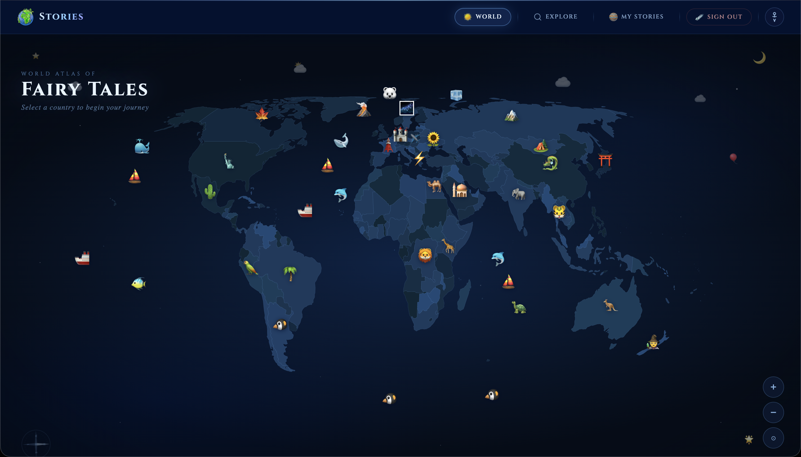

# Map Fairy Tales

An interactive world map where you can discover classic folk tales and generate AI-powered fairy tales for any country.

## Demo

[]()



## Features

- **Interactive World Map** — click any country to explore its stories
- **AI Story Generation** — create unique fairy tales with Groq (Llama 3) + Bria AI image generation
- **Classic Tales** — curated collection of traditional folk stories by country
- **Explore Feed** — browse all user-created stories with search, sort, and star rating filter
- **Rating & Comments** — rate stories with stars and leave comments
- **Multi-language** — stories available in original and translated versions
- **Credits System** — purchase credits via WayForPay (UAH) or Stripe to generate stories
- **Accessibility Panel** — reduce motion, high contrast, large text, dyslexia-friendly font
- **Mobile-first** — fully responsive with hamburger navigation

## Tech Stack

| Layer | Technology |
|-------|-----------|
| Framework | Next.js 14 (App Router) |
| Auth | Firebase Authentication (Google OAuth) |
| Database | MongoDB + Mongoose |
| Storage | Firebase Storage |
| AI — Text | Groq (llama-3.1-8b-instant) |
| AI — Images | Bria AI |
| Payments | WayForPay + Stripe |
| Rate Limiting | Upstash Redis |
| Styling | CSS Modules + MUI v6 |

## Getting Started

### Prerequisites

- Node.js 18+
- MongoDB database
- Firebase project
- Groq API key
- Upstash Redis instance

### Installation

```bash
git clone https://github.com/romkravets/map-fairy-tales.git
cd map-fairy-tales
npm install
```

### Environment Variables

Copy `.env.example` to `.env.local` and fill in your values:

```bash
cp .env.example .env.local
```

### Run locally

```bash
npm run dev
```

Open [http://localhost:3000](http://localhost:3000).

## Project Structure

```
src/
├── app/                  # Next.js App Router pages + API routes
│   ├── api/              # Server-side API endpoints
│   ├── explore/          # Story feed page
│   ├── settings/         # Account & credits management
│   ├── stories/          # Country stories page
│   └── story/            # Single story view
├── components/           # React components
│   ├── MapWorld/         # Interactive SVG world map
│   ├── Story/            # Full story reader
│   ├── ExploreFeed/      # Stories grid with search/filter
│   ├── CountryStories/   # Country page with AI story creator
│   └── AccessibilityPanel/
├── context/              # React Context (auth state)
├── db/                   # Firebase + MongoDB clients
├── helpers/              # Utilities & design tokens
├── layout/               # PrimaryLayout (header + nav)
├── lib/                  # Server-only utilities (credits, rate limiting)
└── models/               # Mongoose schemas
```

## Scripts

```bash
npm run dev       # Development server
npm run build     # Production build
npm run start     # Start production server
npm run lint      # ESLint
npm test          # Jest tests
```

## License

MIT
